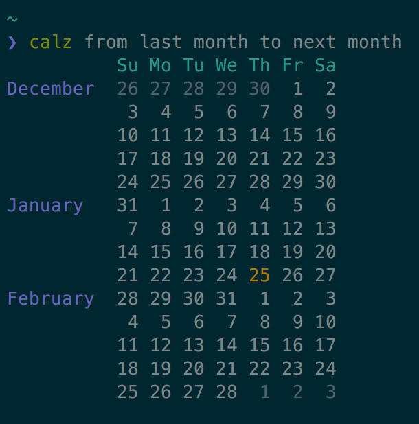

# calz

> A feature-rich command line cal alternative

I'm a huge fan of the Unix `cal` program, but it has a limited set of features
when it comes to colors and displaying date *ranges*. `calz` is an alternative
to `cal` with a whole host of features and layouting options.




## Install

To build this project from source, use Haskell's [Stack].

[Stack]: https://docs.haskellstack.org/en/stable/

```
git clone https://github.com/jez/calz.git

stack build && stack install
```

If you've packaged this software for your operating system, let me know and I
can link to it from these instructions.

## Usage

```
Display a calendar for a month or a range of months.

Usage:
  calz [options] [<phrase>...]

Options:
  -l, --layout=<layout>  Can be 'grid' or 'flow' [default: flow]
  -n, --columns=<n>      If layout is 'grid': how many columns to use
                         [default: 3]
  -C, --no-color         Disable all color
  -H, --no-labels        Don't show month labels
  -P, --no-pad           Complete the first and last weeks of every month with
                         the first and last days of surrounding months
  -h, --help             Show this help message

Phrase:
  calz <month> [<year>]
  calz <year>
  calz (last|this|next) (month|year)
  calz last <n> (months|years)
  calz <n> (months|years) ago
  calz next <n> (months|years)
  calz <n> (months|years) from (now|today)
  calz from <phrase>... to <phrase>...

Examples:
  dec 2017
  next month
  3 months ago
  from 2 months from now to next year
```

The goal is to accept as many commonly used phrases for talking about dates as
possible. If you find yourself using a phrase that's not accepted, please open
an issue.


## Potential Future Features

- Highlight arbitrary ISO-8601 dates provided on stdin
- Display line separators between months in flow layout
- Customize colors with flags


## License

[](https://jez.io/MIT-LICENSE.txt)

